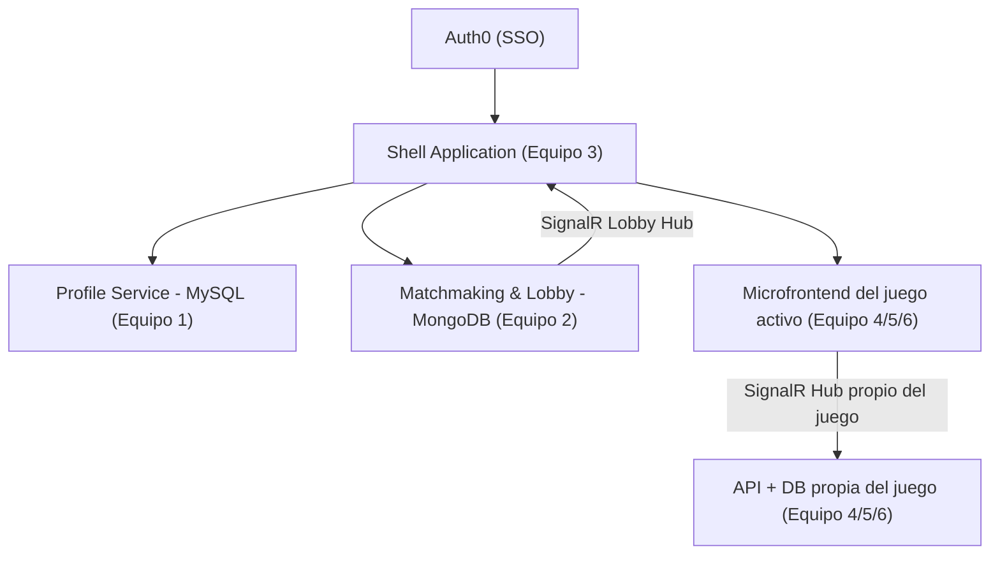
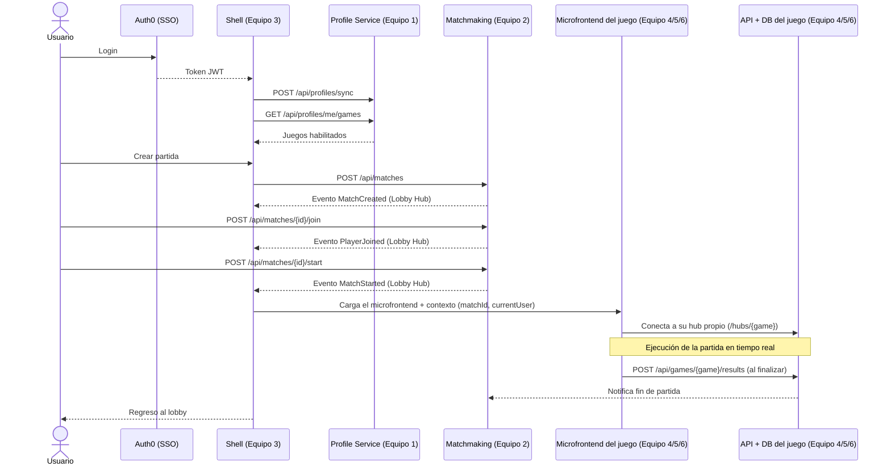

# Arquitectura General - BattleHub

## Objetivo

Plataforma de minijuegos educativos multijugador basada en microservicios y microfrontends.

Objetivos académicos cubiertos: OAuth2/OIDC, SSO con Auth0, JWT y Claims, autorización vs autenticación, APIs REST, tiempo real con SignalR, arquitectura distribuida, microfrontends, persistencia políglota (MySQL/MongoDB/otras), contratos entre equipos, integración continua y pruebas automatizadas.

## Stack tecnológico decidido

- **Frontend**: Aurelia para el Shell y para **todos** los microfrontends (Typing, Trivia, Memory). No se mezclan otros frameworks de frontend en este proyecto.
- **Integración de microfrontends**: se intentará usar **Module Federation** (disponible vía Webpack, con el cual Aurelia es compatible) como estrategia de carga dinámica de cada microfrontend desde el Shell. Es la estrategia que se probará en esta etapa; si durante la implementación surgen limitaciones propias de Aurelia con Module Federation, se debe documentar la alternativa mediante un ADR en `battlehub-contracts` antes de cambiarla.
- **Backend**: **.NET 10** para todos los servicios backend del proyecto (Profile Service, Matchmaking, y la API de cada uno de los tres juegos).
- **Bases de datos**: políglota. Profile Service usa MySQL y Matchmaking usa MongoDB (fijo); cada equipo de juego elige su propio motor de persistencia (ver `04-persistencia-y-api-juegos.md`).

## Despliegue

En esta etapa el despliegue se realizará de forma **manual** (sin un pipeline de CD automatizado). El Tech Lead compartirá instrucciones específicas de despliegue más adelante.

## Convención de fechas

Todas las fechas y timestamps del sistema (creación de partidas, resultados de juego, logs, etc.) deben manejarse y almacenarse en **UTC**, en formato ISO-8601 con sufijo `Z` (ejemplo: `2026-09-02T20:00:00Z`). La conversión a hora local, si se necesita, es responsabilidad exclusiva de la capa de presentación (Shell o microfrontend).

## Diagrama lógico

## Responsabilidades por equipo

### Equipo 1 - Identity & Profile Service

- Creación y administración de la **cuenta/tenant de Auth0** del proyecto (recurso compartido por todos los equipos; ver detalle de administración en `01-gobernanza-repositorios.md`).
- Integración con Auth0.
- Sincronización de usuarios autenticados.
- Creación automática de perfil local.
- Administración de permisos y claims de negocio.
- Exposición de información del perfil.
- Base de datos: MySQL.
- Backend: .NET 10.

### Equipo 2 - Matchmaking & Lobby Service

- Crear, listar, unirse, salir e iniciar partidas.
- Administración de salas y limpieza automática (HostedService/cron job) de salas vacías, abandonadas, sin heartbeat o expiradas.
- Comunicación en tiempo real vía SignalR (Lobby Hub).
- Base de datos: MongoDB.
- Backend: .NET 10.
- El matchmaking nunca implementa lógica específica de un juego ni persiste resultados de partida: solo el ciclo de vida de la sala.

### Equipo 3 - Shell Application

- Login mediante Auth0.
- Administra su propia aplicación registrada en el tenant de Auth0 (ver `01-gobernanza-repositorios.md`).
- Integración con Profile Service y Matchmaking.
- Carga dinámica de microfrontends construida en Aurelia, usando Module Federation.
- Menú principal y navegación.
- Control de sesión única (una sola pestaña activa por usuario, vía `BroadcastChannel` o eventos de `localStorage`).
- Frontend: Aurelia.

### Equipos 4, 5 y 6 - Juegos (Typing, Trivia, Memory)

Cada equipo de juego es dueño de un microservicio completo, no solo de un microfrontend. Esto incluye:

- Microfrontend en Aurelia que se integra al Shell vía Module Federation.
- Hub propio de SignalR para la mecánica de juego en tiempo real.
- API REST propia del juego en .NET 10 (ver `04-persistencia-y-api-juegos.md`).
- Base de datos propia para persistir partidas jugadas, resultados y estadísticas (el motor de BD queda a elección de cada equipo, documentado con un ADR en `battlehub-contracts`).
- Integración con Matchmaking (recibe `matchId` y `currentUser`, reporta fin de partida).
- Administra su propia aplicación registrada en el tenant de Auth0 (ver `01-gobernanza-repositorios.md`).

| Equipo | Juego | Hub propio |
|---|---|---|
| Equipo 4 | Typing Battle | `/hubs/typing` |
| Equipo 5 | Trivia Battle | `/hubs/trivia` |
| Equipo 6 | Memory Match | `/hubs/memory` |

## Flujo general end-to-end (con responsable por paso)

## Pendientes por definir (a resolver por cada equipo con ADR en `battlehub-contracts`)

- Motor de base de datos específico de cada juego (Typing, Trivia, Memory).
- Detalles finos de la integración de Module Federation con Aurelia (a validar durante la implementación).
