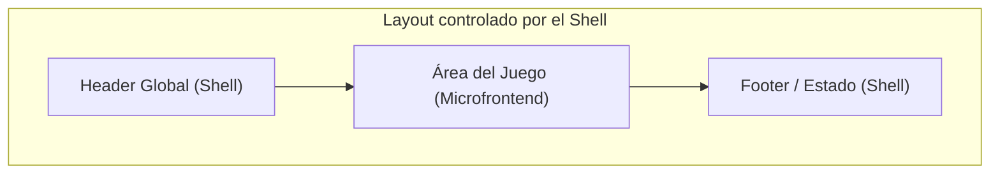

# Contratos Técnicos

Toda desviación de estos contratos requiere un ADR aprobado en `battlehub-contracts` (ver `06-adr-template.md`).

Stack fijo para todos los servicios: backend en **.NET 10**, frontend (Shell y microfrontends) en **Aurelia** integrado vía **Module Federation**.

Todas las fechas/timestamps en los ejemplos siguientes están en **UTC** (formato ISO-8601 con sufijo `Z`).

## 1. Profile Service

Base URL: `/api/profiles`

| Método | Ruta | Descripción |
|---|---|---|
| POST | `/api/profiles/sync` | Sincroniza el usuario autenticado (crea perfil local si no existe) |
| GET | `/api/profiles/me` | Obtiene el perfil actual |
| GET | `/api/profiles/me/permissions` | Obtiene los claims/permisos del usuario |
| GET | `/api/profiles/me/games` | Obtiene el catálogo de juegos habilitados para el usuario |

Permisos ejemplo:

```text
matches.create
games.typing.play
games.trivia.play
games.memory.play
```

## 2. Matchmaking Service

Base URL: `/api/matches`

| Método | Ruta | Descripción |
|---|---|---|
| POST | `/api/matches` | Crear partida |
| GET | `/api/matches` | Listar partidas (filtros: `?gameType=trivia`, `?status=Waiting`) |
| GET | `/api/matches/{matchId}` | Detalle de partida |
| POST | `/api/matches/{matchId}/join` | Unirse a partida |
| POST | `/api/matches/{matchId}/leave` | Salir de partida |
| POST | `/api/matches/{matchId}/start` | Iniciar partida |
| DELETE | `/api/matches/{matchId}` | Cancelar partida |

Modelo mínimo de una partida:

```json
{
  "id": "match-001",
  "title": "Trivia General",
  "gameType": "trivia",
  "createdBy": "user-001",
  "createdAt": "2026-09-02T20:00:00Z",
  "currentPlayers": 2,
  "maxPlayers": 10,
  "status": "Waiting"
}
```

Limpieza automática (HostedService/job) debe eliminar: salas vacías, salas abandonadas, salas sin heartbeat, salas expiradas.

## 3. Eventos SignalR - Lobby Hub

Ruta del hub: `/hubs/lobby`

Cliente -> Servidor:

```text
JoinLobby()
JoinMatch(matchId)
LeaveMatch(matchId)
Heartbeat(matchId)
```

Servidor -> Cliente:

```text
MatchCreated
MatchUpdated
MatchDeleted
PlayerJoined
PlayerLeft
MatchStarting
MatchStarted
MatchFinished
```

## 4. Hub propio por juego

Cada juego expone su propio hub, independiente del Lobby Hub:

```text
/hubs/typing   (Equipo 4)
/hubs/trivia   (Equipo 5)
/hubs/memory   (Equipo 6)
```

El matchmaking nunca implementa lógica específica de juegos; el hub de juego es responsabilidad exclusiva de cada equipo de juego.

## 5. Contrato de entrada a un juego

Cuando el Shell carga un microfrontend, le entrega el siguiente contexto:

```json
{
  "matchId": "match-001",
  "gameType": "trivia",
  "currentUser": {
    "id": "user-001",
    "displayName": "Francisco"
  }
}
```

## 6. Contrato de ciclo de vida del microfrontend (Game Module)

Todos los microfrontends se construyen en **Aurelia** y se exponen al Shell como remotes de **Module Federation**. Cada microfrontend debe exponer un componente/módulo que implemente esta interfaz:

```typescript
interface GameModule {
    initialize(context: GameContext): Promise<void>;
    start(): Promise<void>;
    pause(): Promise<void>;
    dispose(): Promise<void>;
}
```

- `initialize`: recibe el contexto (matchId, gameType, currentUser) y prepara el estado inicial, sin iniciar la partida todavía.
- `start`: comienza la ejecución del juego (conecta al hub propio, arranca temporizadores, etc.).
- `pause`: pausa la ejecución (por ejemplo, si el usuario navega fuera del área del juego).
- `dispose`: libera recursos, desconecta del hub propio, y limpia listeners antes de que el Shell descargue el microfrontend.

## 7. Contrato visual de microfrontends

Principio: el Shell es dueño del layout. Los juegos únicamente renderizan dentro del área asignada.

Los microfrontends no pueden:

- Modificar la navegación global.
- Modificar el login.
- Manejar claims/permisos directamente (deben consultarlos vía Profile Service).
- Alterar el layout global (header/footer).

Layout:



Restricciones de tamaño:

```text
Width: 100%
Max Width: 1440px
Min Width: 1024px
Min Height: 700px
```

Resolución mínima soportada: `1366 x 768`.

Estructura sugerida del área del juego:

- Área superior: nombre del juego, nombre de la partida, tiempo restante.
- Área central: el juego en sí.
- Área lateral (opcional): jugadores, puntajes, estado.

## 8. Repositorios y su contenido

```text
battlehub-profile-service
battlehub-matchmaking
battlehub-shell
battlehub-game-typing
battlehub-game-trivia
battlehub-game-memory
```

Repositorio administrado por el Tech Lead:

```text
battlehub-contracts
```

Contenido de `battlehub-contracts`: OpenAPI, DTOs, eventos de SignalR, arquitectura, ADRs (`/adrs`), Game SDK, UI Guidelines, y las políticas descritas en `01-gobernanza-repositorios.md` y `05-cicd-testing-commits.md`.
